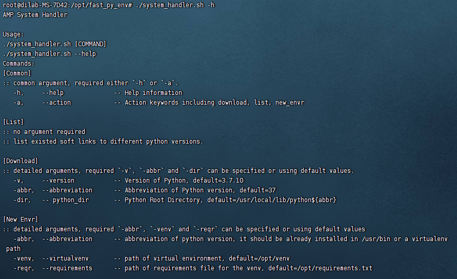
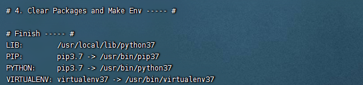
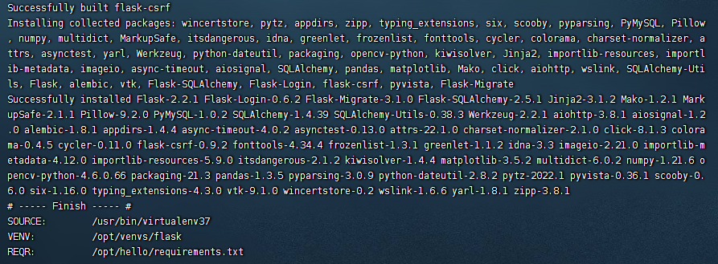
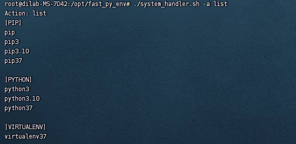

# Make Python Installation Faster
Recently I am annoyed in manual python installation on **Ubuntu**,
especially when I am often changing servers or the python versions
due to the experimental requirements or development requirements.

Inspired by the JumpServer installation scripts, I coded the main functions
that I commonly require in my coding life based on Bash.

This is a rough tool for helping fast python installation. It basically concludes three
main functions
- Download and install a new version of python and install on the specific path. Also, it can generate soft links to `pip`, `python`, `virtualenv`.
- Create a new virtual environment to a specific path.
- List all the `pip*`, `python*`, `virtualenv*` under `/usr/bin/`.

It is well-working on Ubuntu 22.04, tested with only `Python 3.7.*` and `Python 3.9.*`.  
If you have any problems when you are using the tools, please inform me by `hokyeejau@foxmail.com`

# Notice
1. The tool is only tested on **Ubuntu 22.04**. Although there is little possibility that the bash is not able to be wrong implemented, still be careful!
2. The tool is basically designed for automatic installation of **python 3.7+**. Python 2 remains uncertainty.
3. The tool is very simple and coded only in Bash. As this is a **rough** tool for constructing experimental environments for my **web** developing and **ai** model training, 
the libs required or python installation configurations are all from my needs. You could modify the installation configurations in `install.sh: 30`.
4. Make sure you are using `root` user, or the `sudo` will not work.
5. Better to change the mode of the files like `chmod 777 *`

# Usage
Clone or download this tool and move the tool to wherever you like.  
I mostly put under `/opt`.

# Introduction
The options are very sensitive in this place. There is a you-should-input option `--action` except `--help`.

## Help Information
As the tool is designed like the normal tools with help option in the named argument list,  
you could briefly input
```shell
./system_handler.sh 
```
or
```shell
./system_handler.sh -h 
```
or 
```shell
./system_handler.sh --help
```
for showing all the details.


## Actions
There are three actions: `install`, `new_envr`, and `list`.

### Install
Action: __install__  
Default values of installation
- Python Directory: `/usr/local/lib/`
- Python Version: `3.7.10`
- Abbreviation of Python Version: `37` for suffixing `pip*`, `python*`, `virtualenv*`. For example, `pip37` will be soft linked from `/usr/local/lib/python37/lib/pip3.7`.

For quick default installation:
```shell
./system_handler.sh -a install
```
__Make sure that there is no other link having same name with those 3 links.__
The final result is as follow:


If you want to change the python version, the short version info and python directory, try the following input:
```shell
./system_handler.sh -a install -v 3.9.3 -abbr 393 -dir /path/for/python/libs
```

### New Env
Action: __newenv__  
Default values of new virtual environment  
- Abbreviation of Python Version: `37`
- Virtual Environment Path: `/opt/venv`
- Requirement File: `/opt/requirements.txt`

For quick default venv configurations (if you have the soft links in `/usr/bin` as mentioned in [Install](###Install))
```shell
./system_handler.sh -a new_env
```

If you want to apply another python, path of requirement file and virtual environment link, you can try:
```shell
./system_handler.sh -a new_env -abbr /another/python/dir/bin/python3 -venv /new/venv/path -reqr /another/requirement.txt
```

### List
Action: __list__
No option required in this case.
The tool will show you all the `pip*`, `python*`, `virtualenv*` under `/usr/bin/`
```shell
./system_handler.sh -a list
```

